# 2026-09-14 작업 공유 · 화면과 API

이번 반영은 Flutter Android 화면·mock 동작·필요 서버 함수·계약·검증을 묶은 개발 인계다. 기존 일정/수동 비용 작업을 포함하고, 장소 → 준비 → 참여자/개인 정산 → 여행 설정 → 영수증 검토 순서로 확장했다.

## 디스코드에 붙여넣을 글

```text
[Trip Split 개발 현황 공유]

최신 dev에 화면·동작·필요 서버 함수까지 묶어서 반영했습니다.

추가/완성한 내용
• 일정 추가·수정·삭제, 장소 연결/해제, 꾹 눌러 순서 변경, 날짜·A/B안과 지도 순서 유지
• 장소 검색·링크·직접 입력·보관함, 예약·체크리스트 등록/수정/완료
• 참여자 관리·내 계정 연결, JPY/KRW별 개인 소비·송금 제안·복사
• 내 여행 목록, 제목/기간 설정, 공유 코드 재생성·공유
• 수동 비용 CRUD, 영수증 촬영/선택 → 검토·항목 배분 → 지출 저장
• 지출 validator/CRUD 서버, 장소·OCR Emulator 서버, 내 여행/내 참여자 연결 API

담당은 그대로입니다.
- 저는 Flutter 전체·공통·통합과 Android QA를 맡습니다.
- 일정·지도 백엔드는 backend/src/places와 관련 Rules/테스트를 검토하고 URL·동시 변경 예외부터 보강해 주세요.
- 정산·영수증 백엔드는 backend/src/settlement, backend/src/ocr의 금액·참조·항목 검증을 확인하고 실제 OCR 연결 준비를 이어가 주세요.

기반 함수는 이미 있으니 새로 만들기보다 최신 코드를 먼저 보고 이어가면 됩니다.
Node 22 / Java 21에서 npm ci → npm run verify:fast → npm run test:emulator로 시작하면 됩니다.
작업 전과 push 직전 origin/dev를 동기화하고, 전체 검증 후 dev에 직접 반영합니다.

검증: Flutter 117개, React 59개, backend 32개, Firebase Emulator 21개 통과. Android debug APK 빌드 완료.
Google 장소 검색/OCR는 아직 Emulator 샘플입니다. 실제 유료 API·운영 배포·두 Android 기기 전체 QA는 후속입니다.
React Pages 목업에 이번 Flutter 화면이 자동 반영되는 것은 아닙니다.

시작 안내: https://github.com/jim361/trip-split/blob/dev/docs/development-kickoff.md
API 명세: https://github.com/jim361/trip-split/blob/dev/docs/frontend-api-handoff.md
화면 캡처: https://github.com/jim361/trip-split/blob/dev/docs/development-update-2026-09-14.md
```

위 글은 복사용 초안이며 Discord에 자동 전송하지 않았다. GitHub Issue와 main 릴리스 PR의 변경/종료/merge도 이번 범위에 포함하지 않는다.

## 검증 결과와 한계

- `npm run verify:full`: 포맷·lint·TypeScript·React 59개/backend 32개 단위 테스트·build·Emulator 21개 통과.
- `npm run verify:flutter:full`: Dart 포맷·analyze·117개 테스트·Android debug APK 통과.
- 새 회귀는 장소 수정/참조 안내, 준비 CRUD/완료, 참여자 연결 보존, OCR 자동 저장 방지·총액 차이 차단·미지원 통화, 오류 수동 전환, 200% 글씨/키보드와 결정적인 송금 제안을 포함한다.
- Emulator는 두 인증 사용자의 지출 변경·권한·본인 연결 경쟁·감사 정보/참조/금액 변조·준비 Rules를 검증했다. 실제 외부 Google/OCR는 호출하지 않았다.
- 카메라/Photo Picker/공유/지도 Intent는 Android 코드·APK 빌드를 확인했다. 실기기 수동 QA, 두 Android 클라이언트 전체 흐름, Google Maps SDK·외부 provider 연결은 남아 있다.
- 기존 멤버 uid backfill/재참여와 새 index 반영 계획, 장소 참조 중 삭제의 서버 원자성은 [API 인계](frontend-api-handoff.md)에 명시했다.

## 흐름별 화면 캡처

390×844 논리 크기에서 **실제 Flutter Widget을 렌더링한 PNG**다. 검토용 fixture와 한국어/일본어 글꼴을 사용했다. Android 상태 표시줄·실제 카메라 앱·Google 지도·외부 OCR 실행을 촬영한 이미지는 아니다. 아래 번호는 캡처 순서다.

### 1–2. 장소 검색 → 직접 입력·저장

| 검색·후보·보관함                                          | 장소 입력                                              |
| --------------------------------------------------------- | ------------------------------------------------------ |
| 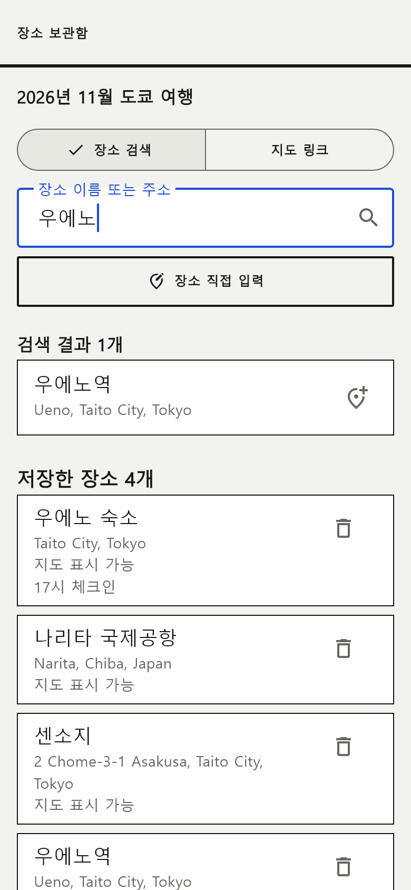 | 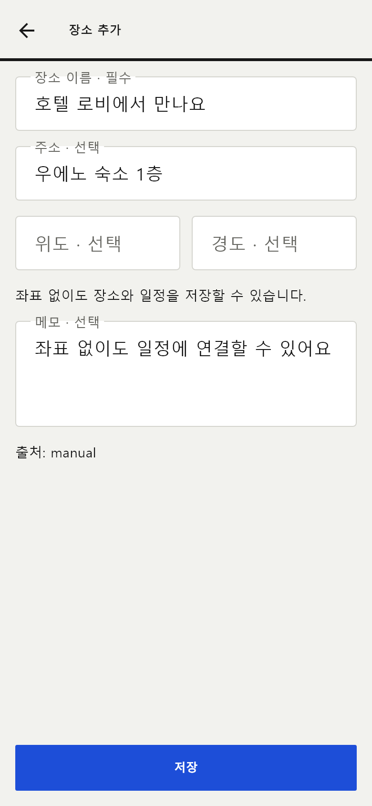 |

좌표가 없어도 장소를 저장하고 일정에 연결할 수 있다. 검색·링크 결과는 검토 후 저장한다.

### 3–4. 예약·체크리스트 → 예약 입력

| 준비 목록·완료 상태                                     | 예약 입력                                                    |
| ------------------------------------------------------- | ------------------------------------------------------------ |
| 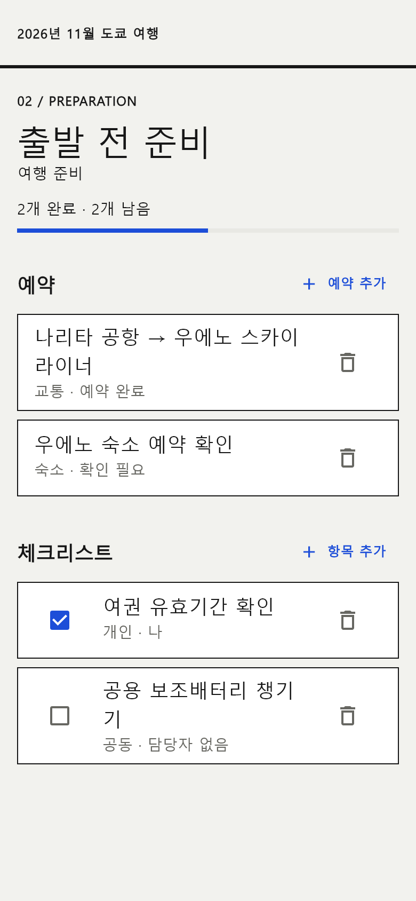 | 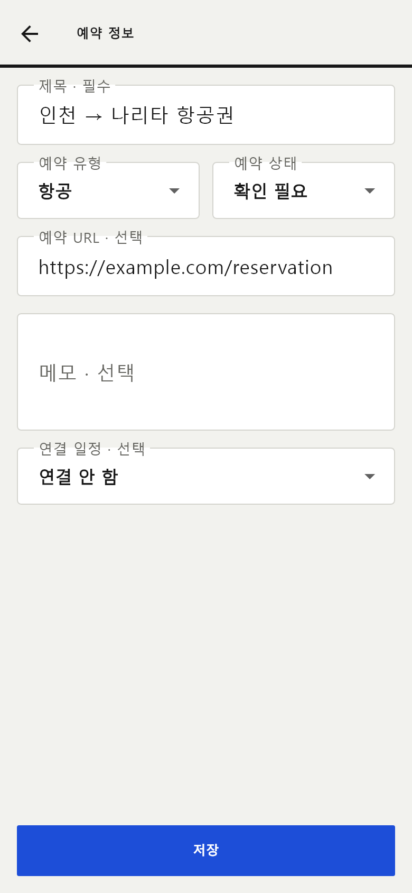 |

### 5–6. 참여자 관리 → 여행 설정·공유

| 참여자·본인 연결                                      | 여행 설정·공유                                            |
| ----------------------------------------------------- | --------------------------------------------------------- |
| 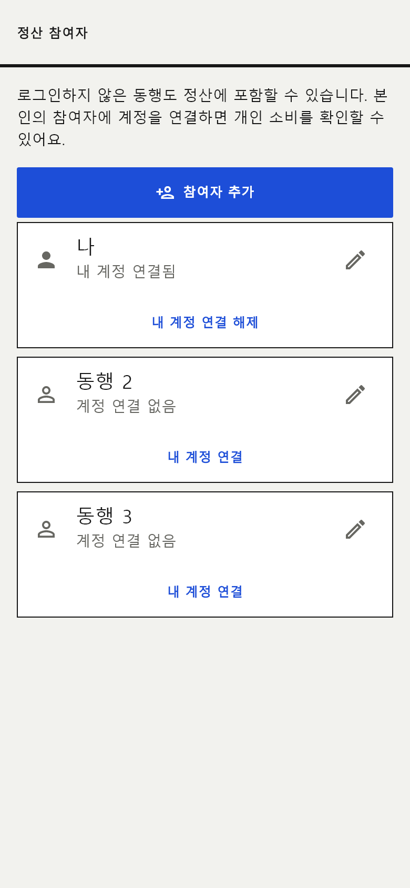 | 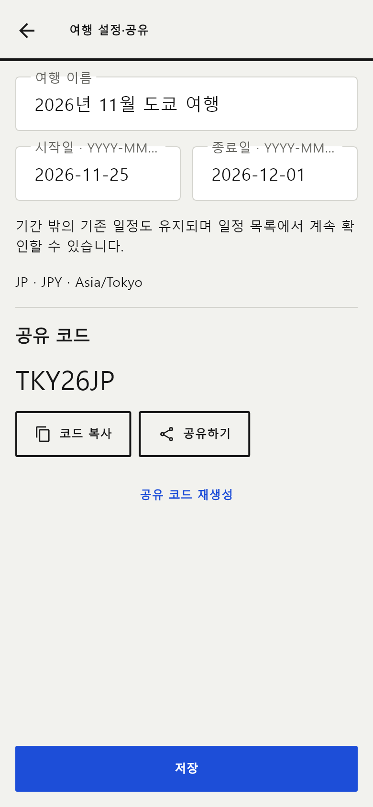 |

### 7–8. 영수증 이미지 → 인식 후보 검토

| 이미지·샘플·실패 대안                                         | 검토 기본 정보                                               |
| ------------------------------------------------------------- | ------------------------------------------------------------ |
| 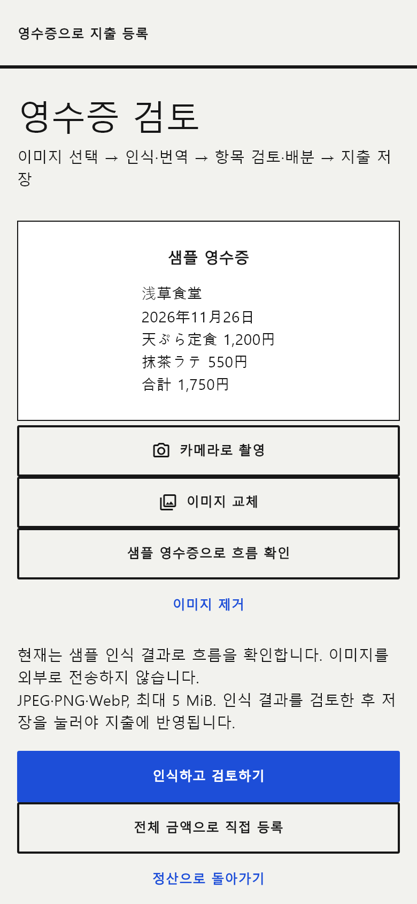 | 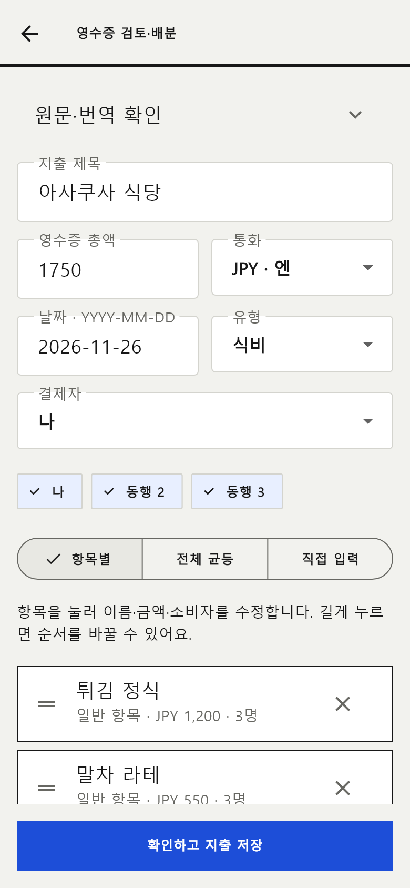 |

### 9–10. 항목 편집 → 배분 합계 확인

| 이름·금액·소비자 편집                                    | 전체 배분·차액                                                  |
| -------------------------------------------------------- | --------------------------------------------------------------- |
| 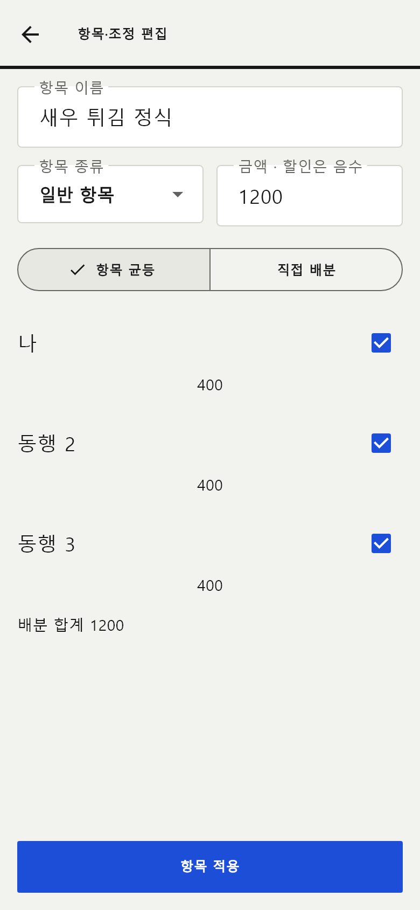 | 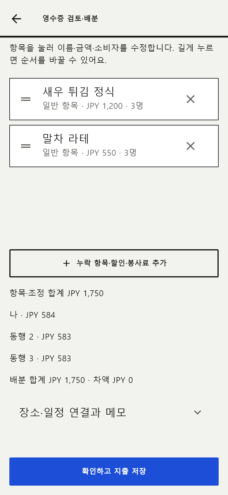 |

일반 항목 외 할인·봉사료·기타 조정도 같은 편집기에서 추가한다. 행 순서를 길게 눌러 바꿀 수 있으며 합계가 맞아야 저장된다.

### 11–13. 저장된 지출 → 개인 소비·송금 제안

| 저장된 지출 상세                                            | 개인 정산                                                       |
| ----------------------------------------------------------- | --------------------------------------------------------------- |
| 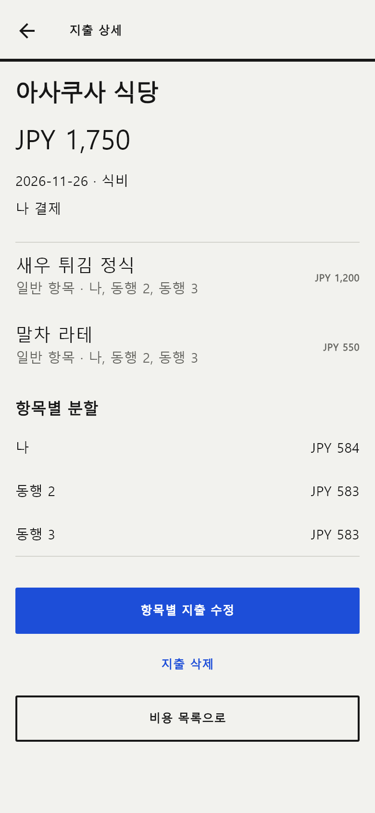 | 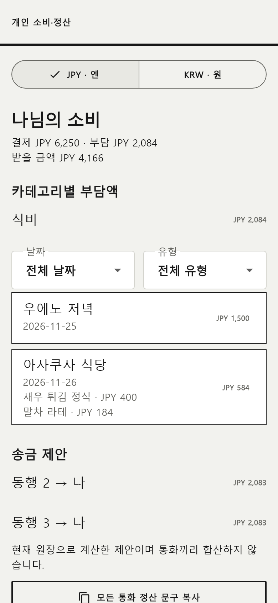 |

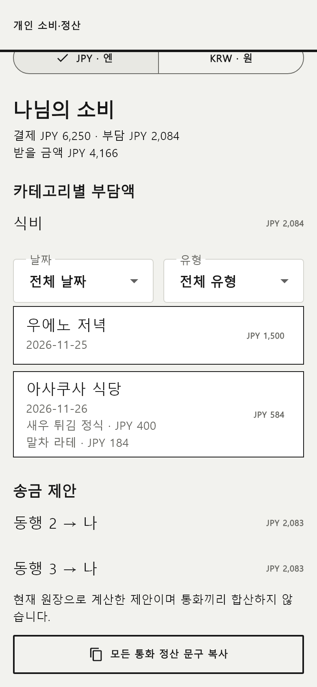

JPY 1,750을 3명에게 항목별로 나눠 584/583/583으로 저장한 예시다. 기존 JPY 4,500 지출과 함께 나의 부담은 2,084, 받을 금액은 4,166이며 동행 두 명의 송금 제안은 각각 2,083이다. 다른 통화는 별도 표시한다.
