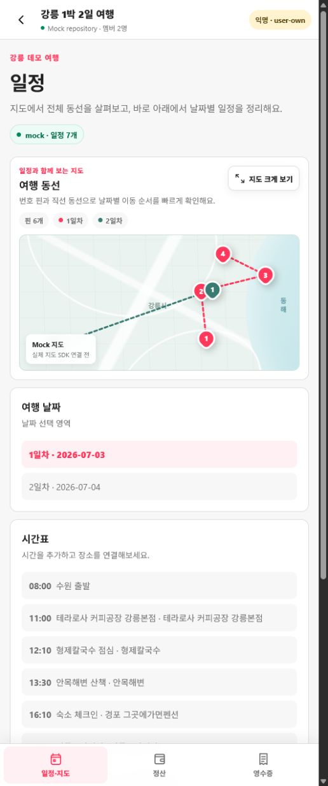
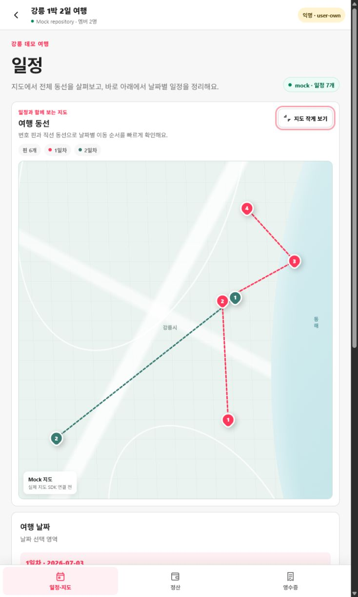

# 일정·지도 통합 목업 리뷰

설치 없이 확인: [GitHub Pages 반응형 목업](https://jim361.github.io/trip-split/)

공개 페이지는 실제 Firebase나 유료 API에 연결하지 않고 고정 강릉 fixture와 mock repository만 사용합니다.

2026-07-14 제품 결정에 따라 일정과 지도를 하나의 주요 화면으로 합친 검토용 목업입니다. GitHub Pages의 실제 반응형 화면과 아래 이미지를 기준으로 팀 의견을 모읍니다.

## 이번 변경

- 주요 내비게이션: `일정·지도 / 정산 / 영수증`
- 일정 화면 상단: 축소 지도, 날짜별 번호 핀, 직선 동선
- 지도 아래: 여행 날짜, 시간표, 장소 보관함
- `지도 크게 보기`: 같은 화면에서 확대하고 URL에 `?map=expanded` 반영
- 기존 `/trips/:tripId/map`: 확대된 통합 일정 화면으로 redirect

## 목업 이미지

| 기본 지도 + 일정                                                    | 확대 지도 + 일정                                                      |
| ------------------------------------------------------------------- | --------------------------------------------------------------------- |
|  |  |

## 로컬에서 직접 확인

```bash
npm run dev -- --host 127.0.0.1 --port 4173
```

- 기본: `http://127.0.0.1:4173/trips/gangneung/itinerary`
- 확대 상태 공유: `http://127.0.0.1:4173/trips/gangneung/itinerary?map=expanded`
- 이전 지도 링크 호환: `http://127.0.0.1:4173/trips/gangneung/map`

## 팀 리뷰 질문

1. 기본 지도 높이 약 220px이 전체 동선을 파악하기에 충분한가?
2. 첫 메뉴 이름은 `일정·지도`가 명확한가, 더 짧은 `일정`이 나은가?
3. 지도 확대를 같은 페이지의 세로 확장으로 유지할지, 전체 화면 overlay로 바꿀지?
4. 모바일에서 지도 다음에 `여행 날짜 → 시간표 → 장소 보관함` 순서가 자연스러운가?
5. 실제 NAVER 지도 연결 전 현재 번호 핀과 날짜별 색상 표현으로 방향을 판단할 수 있는가?

## 구현 경계

현재 지도는 `Place[]`와 `ItineraryItem[]`로 만든 mock 표현입니다. 실제 NAVER 지도 SDK, 장소 검색, 도로 경로와 예상 이동 시간은 아직 연결하지 않았습니다. 실제 adapter는 동일한 입력 계약을 사용하고 지도 크기 전환 후 resize/recenter를 수행해야 합니다.
