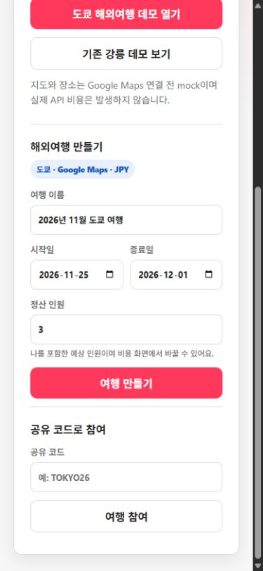
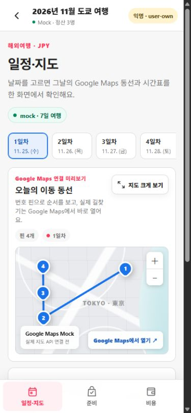
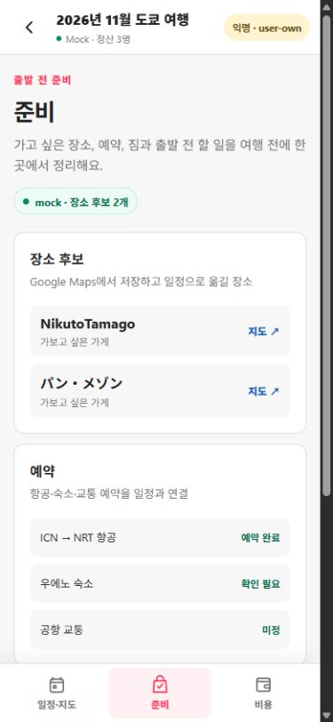
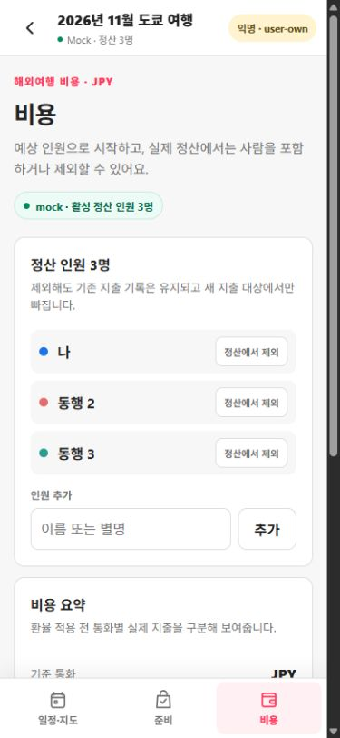

# 해외여행 중심 Trip Split 목업 리뷰

업로드 후 설치 없이 확인: [GitHub Pages 반응형 목업](https://jim361.github.io/trip-split/)

이 변경을 GitHub에 반영하면 공개 페이지는 실제 Firebase나 유료 API에 연결하지 않고 도쿄·강릉 fixture와 mock repository만 사용합니다.

2026-08-27 제품 탐색 결정에 따라 해외여행을 우선하고 Google Maps 연결 방식을 보여주는 검토용 목업입니다. GitHub Pages의 실제 반응형 화면과 아래 이미지를 기준으로 팀 의견을 모읍니다.

## 이번 변경

- 여행 생성: 여행 이름·기간·예상 정산 인원 입력
- 주요 내비게이션: `일정·지도 / 준비 / 비용`
- 일정 화면: 7일 날짜 칩, 선택 날짜의 Google Maps형 mock 지도와 시간표
- 준비 화면: Google Maps 장소 후보, 예약, 출발 전 체크리스트
- 비용 화면: 활성 정산 인원 추가·제외·복원, JPY 지출 원장 경계
- 각 이동 구간: 키가 필요 없는 Google Maps 대중교통 길찾기 URL
- `지도 크게 보기`: 같은 화면에서 확대하고 URL에 `?map=expanded` 반영
- 기존 `/trips/:tripId/map`과 `/receipts`: 지도·OCR 담당자 호환 경로로 유지

## 목업 이미지

| 여행 생성                                                                  | 일정·지도                                                             |
| -------------------------------------------------------------------------- | --------------------------------------------------------------------- |
|  |  |

| 준비                                                             | 비용·정산 인원                                            |
| ---------------------------------------------------------------- | --------------------------------------------------------- |
|  |  |

## 로컬에서 직접 확인

```bash
npm run dev -- --host 127.0.0.1 --port 4173
```

- 생성: `http://127.0.0.1:4173/`
- 도쿄 일정: `http://127.0.0.1:4173/trips/tokyo-2026-11/itinerary`
- 준비: `http://127.0.0.1:4173/trips/tokyo-2026-11/preparation`
- 비용: `http://127.0.0.1:4173/trips/tokyo-2026-11/settlement`
- 확대 상태 공유: `http://127.0.0.1:4173/trips/tokyo-2026-11/itinerary?map=expanded`

## 팀 리뷰 질문

1. 여행 생성에서 인원 수만 먼저 받고 이름은 비용 화면에서 보완하는 흐름이 자연스러운가?
2. 7일 날짜 칩과 선택 날짜별 지도·시간표가 스프레드시트보다 빠르게 읽히는가?
3. 장소 후보와 예약·체크리스트를 `준비` 한 탭에 두는 구성이 맞는가?
4. 정산 인원 제외를 삭제가 아닌 비활성화로 보여주는 문구가 이해되는가?
5. 실제 Google 지도 연결 전에 이 mock과 외부 길찾기 링크만으로 MVP 방향을 판단할 수 있는가?

## 구현 경계

현재 지도는 `Place[]`와 `ItineraryItem[]`로 만든 mock 표현입니다. Google Maps SDK, Places 자동완성, 앱 내부 대중교통 경로와 예상 이동 시간은 아직 연결하지 않았습니다. 실제 adapter는 동일한 입력 계약을 사용하며, 현재 `Google Maps에서 열기` 링크는 Maps URL만 사용합니다.
